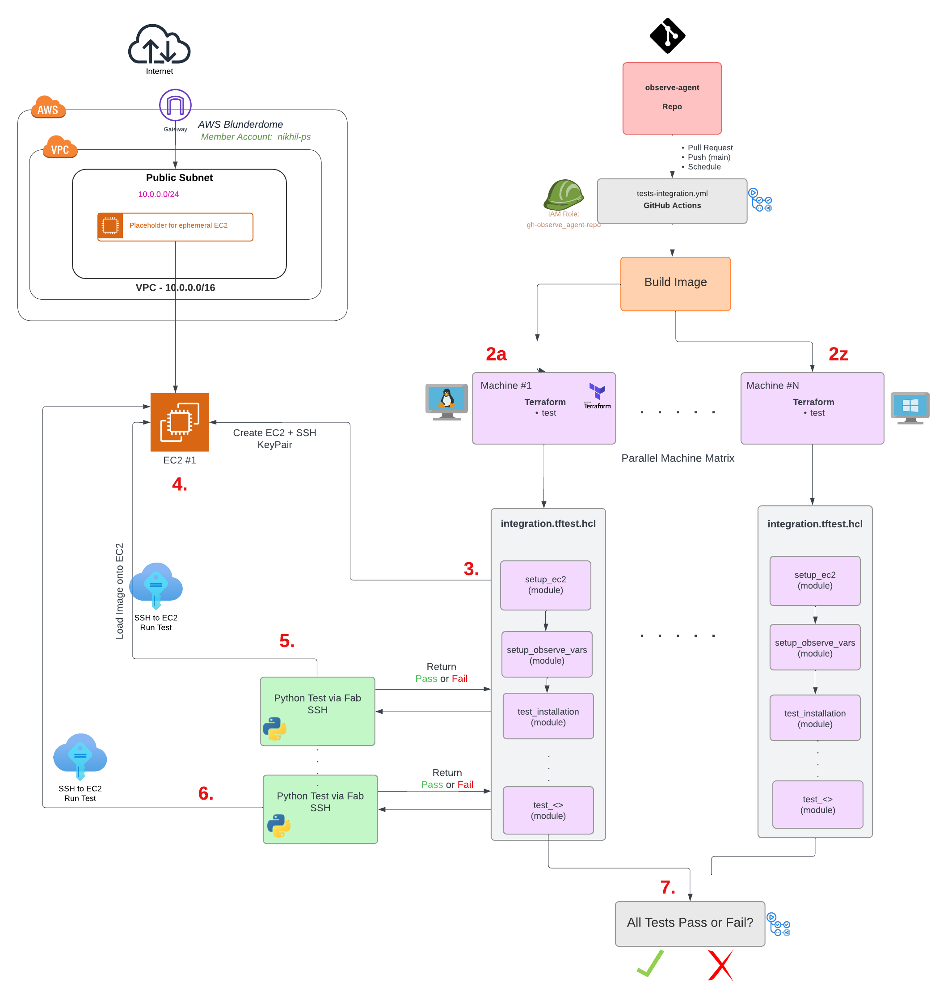

## Integration Tests 


The root of this module location is intended to run integration tests using the terraform test framework. The tests are located at `integration/tests`

The tests are run using the `terraform test -verbose` command from this folder `observe-agent/integration` 

When the above command is run, the tests in the `integration/tests` directory are ran using the variables provided. The tests are ran in the order of the run blocks provided in `<test>.tftest.hcl` 

Generally a test will do the following for any given EC2 Machine:
- Create a machine using the variables provided below in `us-west-1`
- Run a test using `observeinc/collection/aws//modules/testing/exec` module to accept python scripts located at `integration/tests/scripts` 


### Variables 

The tests are run using the following variables. These can be set in the `integration/tests.auto.tfvars` file for local testing. 

```
name_format        = "tf-observe-agent-test-%s"
AWS_MACHINE= "AMAZON_LINUX_2023"  #Choose the AWS Machine to run the tests on 
PUBLIC_KEY_PATH  = "./test_key.pub" #Path to Public Key for EC2
PRIVATE_KEY_PATH = "./test_key.pem" #Path to Private Key for EC2
OBSERVE_URL = "https://<TENANT_ID.collect.observe-staging.com>" #Observe URL to use for testing
OBSERVE_TOKEN ="<DATASTREAM_TOKEN_TO_TEST_OBSERVE_AGENT_WITH">
``` 


Note: You must also set the provider correctly. We use the following settings:
- Region: `us-west-1`
- Profile: `blunderdome`
- IAM Role Assumed: `gh-observe_agent-repo` 
  - The above role has permissions to create and destroy EC2 instances. See `modules/setup_aws_backend/role.tf` for more details.

The provider can be directly set in the `integration/tests/integration.tftest.hcl` as below:

```
provider "aws" {
  region  = "us-west-1" # Specify the AWS region
  profile = "blunderdome"
  assume_role {
      role_arn = "arn:aws:iam::<member_account>:role/gh-observe_agent-repo"
  }
}

```

or through a `provider_override.tf` placed in `modules/create_ec2` directory.


### Local Testing

Any of the python scripts in the `/scripts` directory can be tested by running them directly, granted an EC2 Machine exists. As the scripts rely on the outputs of `create_ec2` and `setup_observe_variables` modules to be passed in as environment variables, these environment variables can be manually set if the modules are not ran.

The `/scripts/<test_xyz.py` expects the following environment variables to be set:

```
HOST="54.177.249.99" #HOST IP Address 
USER="ubuntu" #HOST user to login as 
KEY_FILENAME="./test_key.pem" #Private path to key 
MACHINE_NAME="UBUNTU_22_04_LTS" #Machine name to test 
MACHINE_CONFIG="ami_description:Ubuntu Server 22.04 LTS (HVM)- EBS General Purpose (SSD) Volume Type. Support available from Canonical,ami_id:ami-036cafe742923b3d9,ami_instance_type:t3.small,architecture:amd64,default_user:ubuntu,distribution:debian,package_type:.deb,sleep:120,user_data:user_data/aptbased.sh" #Machine config 
OBSERVE_URL="" #Observe URL to use for testing
OBSERVE_TOKEN="" #Observe Token to use for testing
```

Run the scripts from the folder as below:
```
➜  integration git:(nikhil/integration-testing-windows) ✗ pwd
/Users/nikhil.dua/Documents/observe-repos/observe-agent/integration
➜  integration git:(nikhil/integration-testing-windows) ✗ python3 scripts/test_installation.py
```


### Architecture

The architecture diagram can be found 


  