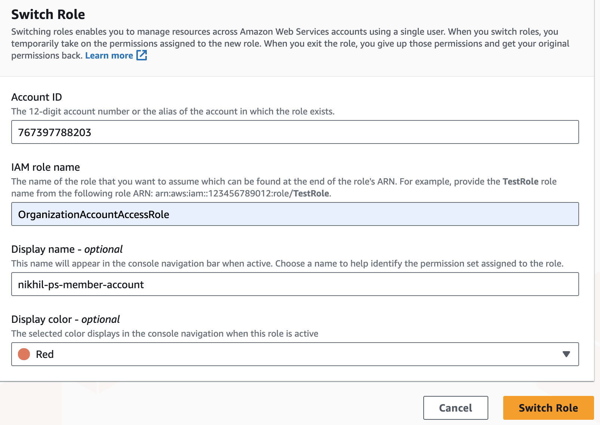

# Integration Tests

The root of this module location is intended to run integration tests using the terraform test framework. The tests are located at `integration/tests`

The tests are run using the `terraform test -verbose` command from this folder `observe-agent/integration`

When the above command is run, the tests in the `integration/tests` directory are ran using the variables provided. The tests are ran in the order of the run blocks provided in `<test>.tftest.hcl`

Generally a test will do the following for any given EC2 Machine:

- Create a machine using the variables provided below in `us-west-1`
- Run a test using `observeinc/collection/aws//modules/testing/exec` module to accept python scripts located at `integration/tests/scripts`

## Pre-requisites

Ensure you have the following:

- Built version of the agent ( in `observe-agent/dist`) using `go-releaser`
- Blunderdome Admin Access in AWS (used to assume the `gh-observe_agent-repo` role for testing )
- Observe Collection URL & Datastream Token to test with
- Generated Private & public key pair ( name to `test_key.pub` & `test_key.pem`)
- Terraform provider overide and terraform variables (see below section on how to do this)

**Building the agent**:

```sh
observe-agent git:(nikhil/update-RM) ✗ goreleaser release --snapshot --clean --verbose
```

If agent distributable is not built, you may get the following message:

```txt
│ Error: Test assertion failed
│ 
│   on tests/integration.tftest.hcl line 65, in run "test_install":
│   65:     condition     = output.error == ""
│     ├────────────────
│     │ output.error is "FileNotFoundError: [Errno 2] No such file or directory: '/Users/nikhil.dua/Documents/observe-repos/observe-agent/dist'"
│ 
│ Error in Installation Test
```

**SSH Key Pairs**:

Generate in PEM format for the OpenSSH Key that will be used by Terraform EC2 Modules:

```sh
ssh-keygen -m PEM
```

For more info on generating SSH keys, see [here](https://docs.aws.amazon.com/AWSEC2/latest/UserGuide/create-key-pairs.html#how-to-generate-your-own-key-and-import-it-to-aws)

Ensure you have  `./test_key.pub`  and `./test_key.pem` in the `integration` directory. This can also be changed and specifed in the `integration/tests.auto.tfvars` file.

Ensure the extensions are correct!

**AWS UI Access (optional)**:

For AWS UI access for viewing machines:

1. Login to Britive Blunderdome

2. Navigate to AWS Console

   

3. Click Switch role and input details for `nikhil-ps-account` which is the member account for integration testing within Blunderdome. Details are the following:

    

4. You can now access EC2 machines and download key pairs (same as what Github Actions workflow uses)

5. Ensure you're in `us-west-1`

## Terraform Variables

The tests are run using the following variables. These can be set in the `integration/tests.auto.tfvars` file for local testing.

```terraform
name_format      = "tf-observe-agent-test-%s"
AWS_MACHINE      = "AMAZON_LINUX_2023"  #Choose the AWS Machine to run the tests on 
PUBLIC_KEY_PATH  = "./test_key.pub" #Path to Public Key for EC2
PRIVATE_KEY_PATH = "./test_key.pem" #Path to Private Key for EC2
OBSERVE_URL      = "https://<TENANT_ID.collect.observe-staging.com>" #Observe URL to use for testing
OBSERVE_TOKEN    = "<DATASTREAM_TOKEN_TO_TEST_OBSERVE_AGENT_WITH">
```

The PUBLIC & PRIVATE key pair can be generated by following the instructions in the "SSH Key Pairs" section above

Example of what the `integrations` folder contains after creating `.*tfvars` file and SSH Key Pair:

]

## Terraform Provider

Note: You must also set the provider correctly. We use the following settings:

- Region: `us-west-1`
- Profile: `blunderdome`
- IAM Role Assumed: `gh-observe_agent-repo`
  - The above role has permissions to create and destroy EC2 instances. See `modules/setup_aws_backend/role.tf` for more details.

The provider can be directly set in the `integration/tests/integration.tftest.hcl` as below:

```terraform
provider "aws" {
  region  = "us-west-1" # Specify the AWS region
  profile = "blunderdome"
  assume_role {
      role_arn = "arn:aws:iam::<member_account>:role/gh-observe_agent-repo"
  }
}

```

or through a `provider_override.tf` placed in `modules/create_ec2` directory.

Example of this:


> [!NOTE]  
> For Terraform to access and assume the role properly, you MUST be logged into Blunderdome Admin in console and have the correct permissions!

Example of this:

```sh
observe git:(master) ✗ s/aws-creds checkout blunderdome

Checked out 'AWS Blunderdome Organization/460044344528 (observe-blunderdome)/BritiveBlunderdome-FullAWSAdmin' into awscli profile 'blunderdome'

observe git:(master) ✗ export AWS_PROFILE=blunderdome         
```

## Local Testing (without terraform test)

Any of the python scripts in the `/scripts` directory can be tested by running them directly, granted an EC2 Machine exists. As the scripts rely on the outputs of `create_ec2` and `setup_observe_variables` modules to be passed in as environment variables, these environment variables can be manually set if the set up modules are not ran.

The `/scripts/<test_xyz>.py` expects the following environment variables to be set:

```sh
HOST="54.177.249.99" #HOST IP Address 
USER="ubuntu" #HOST user to login as 
KEY_FILENAME="./test_key.pem" #Private path to key 
MACHINE_NAME="UBUNTU_22_04_LTS" #Machine name to test 
MACHINE_CONFIG="ami_description:Ubuntu Server 22.04 LTS (HVM)- EBS General Purpose (SSD) Volume Type. Support available from Canonical,ami_id:ami-036cafe742923b3d9,ami_instance_type:t3.small,architecture:amd64,default_user:ubuntu,distribution:debian,package_type:.deb,sleep:120,user_data:user_data/aptbased.sh" #Machine config 
OBSERVE_URL="" #Observe URL to use for testing
OBSERVE_TOKEN="" #Observe Token to use for testing
PASSWORD="WindowsPassword to be used for testing" # Set to None for testing 
```

Run the scripts from the folder as below:

```sh
➜  integration git:(nikhil/integration-testing-windows) ✗ pwd
/Users/nikhil.dua/Documents/observe-repos/observe-agent/integration
➜  integration git:(nikhil/integration-testing-windows) ✗ python3 scripts/test_install.py
```

Note: If testing Windows machines, the RDP password is redacted by default in the python scripts.
This can be turned off when disabling mask by setting below environment variable to `False` before running these scripts

```sh
export MASK=False
python3 scripts/test_ec2_connection.py
------------------------------
Masking Disabled
Env vars set to: 
 {'host': '54.177.26.178', 'user': 'Administrator', 'key_filename': './test_key.pem', 'password': '<exposed_password>, 'machine_name': 'WINDOWS_SERVER_2016_BASE', 'machine_config': {'ami_description': 'Microsoft Windows Server 2016 with Desktop Experience Locale English AMI provided by Amazon', 'ami_id': 'ami-07357c8c8d7501f94', 'ami_instance_type': 't3.small', 'architecture': 'x86_64', 'default_user': 'Administrator', 'distribution': 'windows', 'package_type': '.zip', 'sleep': '120', 'user_data': 'user_data/windows.ps'}, 'observe_url': 'https://179969258044.collect.observe-staging.com/', 'observe_token': '<exposed_token>}
------------------------------
Testing SSH connection to host 54.177.26.178 with timeout 120s
```

## Architecture

The architecture diagram can be found 
